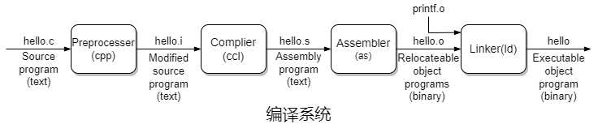
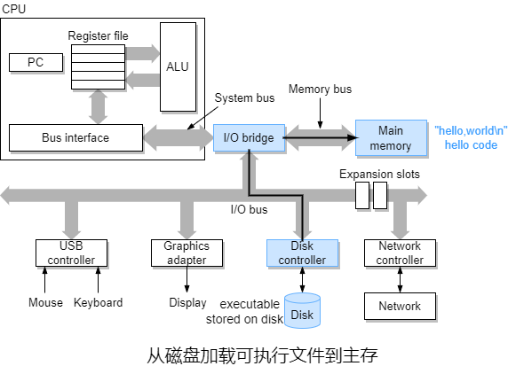

### 第一章 计算机系统概览

​		**计算机系统**由硬件和系统软件组成，它们协调工作来运行应用程序。

​		大部分现代计算机系统都使用ASCII标准来表示文本字符。

​		C语言是贝尔实验室的Dennis Ritchie于1969年\~1973年间创建。ANSI在1989年颁布了ANSI C的标准，后来C语言的标准由ISO的责任。1990年推出了几乎和ANSI C一样的版本，称为ISO C90。1999年推出ISO C99。2011年推出ISO C11。这些标准定义了C语言和一组称为C语言标准库的库函数。

​		20世纪60年代是庞大而复杂的操作系统的年代，例如IBM的OS/360和Honeywell的Multics系统。贝尔实验室曾是Multics项目的最初参与者，由于该项目的复杂性和缺乏进展于1969年退出。同年，贝尔实验室的部分人员开始用机器语言编写Unix系统，于1973年用C语言重新编写内核并在次年发布。

​		20世纪80年代，Unix供应商通过添加新的且通常不兼容的功能来区分自己，IEEE为了对抗这种趋势而开始标准Unix的开发，称为Posix。后来，一项名为“标准Unix规范”的独立标准化工作与Posix联手创建了统一的标准。

​		GNU(GNU's Not Unix)项目由Richard Stallman于1984年发起的一个免税慈善机构，其目标是开发一个完整的类Unix系统，其源代码不受修改和分发方式的限制。GNU项目开发了一个除内核外的包含Unix操作系统所有主要部件的环境，内核由Linux项目独立发展而来。

​		GCC(GNU Compiler Collection)是GNU项目开放的工具之一，可以基于不同命令选项，根据不同版本的C语言规则来编译程序，例如`gcc -std=c11 proc.c`。

| C版本         | GCC命令行           |
| ------------- | ------------------- |
| GNU 89        | `-std=gnu89`        |
| ANSI，ISO C90 | `-ansi`，`-std=c89` |
| ISO C99       | `-std=c99`          |
| ISO C11       | `-std=c11`          |

​		shell是一个命令行解释器，它输出一个提示符，等待输入一个命令行并执行。若该命令行的首个单词不是内置的shell命令，则shell则假设这是一个可执行文件的名称，然后加载并执行。

​		1991年8月，芬兰研究生Linus Torvalds发布了一个出于教育目的的类Unix的操作系统内核Minix，后来逐渐成为了Linux。

​		Gene Amdahl对提升计算机系统部分组件性能的有效性进行了简单但有洞察力的观察，称为<span style="background-color: yellow">Amdahl定律</span>，其主要思想是当提升系统部分组件性能时，对系统整体性能的影响取决于这部分组件的重要性和提升过程。若系统执行某应用程序需要时间$T_{old}$，系统某个组件所需执行时间占比是$\alpha$，当该组件性能提升为原来的$k$倍后，该组件所需执行时间从$\alpha T_{old}$变为$\frac{\alpha T_{old}}{k}$，系统执行该程序需要时间变为$T_{new}$，提升比为$S$。$S$通常用“数字+X”的形式来表示，例如2.2X表示速度提升为原来的2.2倍。
$$
\begin{align}
S&=\frac{T_{old}}{T_{new}}\\
&=\frac{T_{old}}{(1-\alpha)T_{old}+\frac{\alpha T_{old}}{k}}\\
&=\frac{1}{1-\alpha+\frac{a}{k}}
\end{align}
$$
​		因此，若想要提升系统整体性能，就必须提升系统中大部分组件的性能。

#### 1.1 计算机系统的硬件


​		贯穿整个系统的是一组电子导管，称为**总线**，它们在组件间来回传输字节信息。总线通常设计用于传输称为**字**的固定大小的字节块。一个字的字节数(简称字长)是一个基本的系统参数，因系统而异，例如很多机器的字长是4字节或(32位)8字节(64位)。

​		I/O设备是系统与外部的连接通道。每个I/O设备都通过一个**控制器**或**适配器**与I/O总线连接，两者的区别在于封装方式。控制器是I/O设备本身或系统的**主印制电路板**(简称主板)的芯片组，而适配器是一块插在主板插槽上的卡，两者的功能都是在I/O总线与I/O设备间传输信息。

​		网络为计算机系统间的通信提供了途径，从单个系统的角度来看，网络可看作一种I/O设备。

​		**主存储器**(简称主存或内存)是一种在处理器执行程序时保存程序和它操作的数据的临时存储设备。在物理上，内存由一组**动态随机存取存储器**组成。在逻辑上，存储器是一个线性的字节数组，每个字节都有其唯一的地址(从0开始的数组索引)。通常，构成程序的每条机器指令都由不同数量的字节构成。与C语言程序变量对应的数据项的大小因类型而异。

​		**中央处理器**(简称处理器)是解释或执行存储在内存中的指令引擎。处理器的核心是一个大小为一个字的存储设备或寄存器，称为**程序计数器**。在任何时候，PC都指向内存储器中的某些机器语言指令(包含其地址)。

​		处理器看似按照**指令集架构**定义的非常简单的指令执行模型进行操作。在该模型中，指令按严格的顺序执行，执行一条指令涉及一系列步骤。处理器从PC指向的内存中读取指令，解释指令中的位，执行该指令指示的一些简单操作然后更新PC以指向下一条指令，但这两条指令在内存中并不一定相邻。这样的简单操作并不多，它们围绕着内存、寄存器文件和**算术逻辑单元**进行。**寄存器文件**是由一组单字长且都有名称的寄存器组成的小型存储设备。 ALU计算新数据和地址的值。

​		● <span style="background-color: yellow">加载</span>时处理器将一个字节或字从内存复制到寄存器中并覆盖其以前的内容。

​		● <span style="background-color: yellow">存储</span>时处理器将一个字节或字从寄存器复制到内存中并覆盖其以前的内容。

​		● <span style="background-color: yellow">操作</span>时处理器将两个寄存器的内容复制到ALU并进行算术运算，将结果存储在一个寄存器中并覆盖其以前的内容。

​		● <span style="background-color: yellow">跳转</span>时处理器从指令中提前一个字，将该字复制到PC并覆盖其以前的内容。

#### 1.2 信息就是位+上下文

```c
// hello.c
#include <stdio.h>

int main()
{
    printf("hello,world\n");
    return 0;
}
```

​		hello程序生命周期以**源程序**或**源文件**的形式开始。源程序是一个位序列，8个位组成一个字节，每个字节代表程序中的某些文本字符。

​		hello程序以字节序列的形式存储在文件中，每个文本行都以不可见的`\n`结尾，每个字节都有一个对于某个字符(包括`\n`)的整数值。只有ASCII字节构成的文件称为**文本文件**，所有其他文件都成为**二进制文件**。

​		系统中的所有信息(包括磁盘文件、存储在内存中的程序、存储在内存中的用户书籍以及以及通过网络传输的数据)都表示为位串。区分不同数据对象的唯一方法是它们的**上下文**。因此，不同上下文中相同的字节序列可能表示的含义不同。



​		● 在<span style="background-color: yellow">预处理</span>阶段，预处理器(cpp)根据以`#`开头的指令修改原始C语言程序。例如，`hello.c`的首行`#include <stdio.h>`告诉预处理器读取系统头文件`stdio.h`并将其直接插入到程序的文本中结果得到另一个C语言程序，通常是以`.i`作为文件扩展名。

​		● 在<span style="background-color: yellow">编译</span>阶段，编译器(ccl)将文本文件`hello.i`翻译成文本文件`hello.s`，其中包含一个汇编语言程序。

```assembly
main:
	subq	$8, %rsp
	movl	$.LCO, %edi
	call	puts
	movl	$0, $eax
	addq	$8,%rsp
	ret
```

​		● 在<span style="background-color: yellow">汇编</span>阶段，汇编器(as)将`hello.s`翻译成机器语言指令，将它们打包成**可重定位目标程序**的形式并将结果保持在目标文件`hello.o`中。`hello.o`是一个17B的二进制文件，用于对函数`main`的指令进行编码。

​		● 在<span style="background-color: yellow">链接</span>阶段，链接器(ld)负责合并`hello.o`以及其调用的函数并得到`hello`文件。`hello`是一个**可执行目标文件**，简称为**可执行文件**，可以加载到内存中并由系统执行。`hello`调用了`printf`函数，其存在于单独的预编译目标文件`printf.o`中。


​		在shell输入`./hello`后，shell将每个字符读取到寄存器并存储到内存中。当输入回传后，shell执行一系列指令来加载可执行的hello文件，这些指令将hello目标文件中的代码和数据从磁盘复制到内存。数据报包括最终会被输出的`hello,world\n`。



​		使用**直接存储器访问**，数据可以不通过处理器而直接到达内存。


​		一旦hello目标文件中的代码和数据加载到内存中，处理器就会开始执行hello程序中`main`中的机器语言指令。这些指令将`hello,world\n`从内存中复制到寄存器文件，在从寄存器文件中复制到显示设备并显示在屏幕上。

#### 1.3 高速缓存

​		hello程序中系统花费大量时间将信息从一个地方移动另一个地方，因此系统设计者的一个主要目标就是尽可能快地完成这些操作。

​		较大的存储设备相比较小的存储设备更慢，速度较慢的设备相比速度较快的设备制造成本更高。一个典型的寄存器文件只存储数百B的信息，而内存可存放数TB。但处理器从寄存器文件中读取数据的速度几乎是从内存中读取数据的100倍。随着半导体技术的发展，这种处理器和内存之间的差距不断增大，加快处理器的运行速度比加快内存的运行速度更容易也更便宜。


​		为了解决处理器和内存之间的差距，采用了**高速缓存**来存放短期内处理器可能会需要的信息。位于处理器的L1(高速)缓存的容量可达到MB，访问速度几乎和访问寄存器文件差不多。容量可达10MB的L2(高速)缓存通过一条特殊的总线连接到处理器。处理器访问L2缓存的时间可能比L1缓存长3倍左右，但仍然比访问内存快数十倍。L1和L2缓存采用**静态随机存取存储器**实现，L2缓存用于协调L1缓存和内存的速度。L3缓存相比L2缓存容量更大，访问速度也更慢，处理器访问L3缓存的时间比L2缓存长4倍左右。

​		高速缓存的主要思想是系统可以通过高速缓存的<span style="background-color: yellow">局限性</span>(程序访问局部区域中的数据和代码的趋势)来获得很大的内存和很快的访问速度。通过在高速缓存里存放可能经常访问的数据，可以使用高速缓存执行大多数内存操作。

#### 1.4 存储器层次结构


​		在**存储器层次结构**中，从顶部到底部，存储器越来越大，速度越来越慢，存储每个字节成本越来越低。寄存器文件在层次顶部，称为L0或0级。L1\~L3缓存依次占据L1\~L3，内存占据L4，本地二级存储占据L5，远程二级存储占据L6。

​		存储器层次结构的主要思想是上一个级的存储器作为下一级存储器的高速缓存。因此，寄存器文件是L1缓存的缓存，L1缓存是L2缓存的缓存，依次类推。

#### 1.5 操作系统


​		操作系统的基本功能包括<span style="background-color: yellow">防止硬件被失控的应用程序滥用</span>和<span style="background-color: yellow">为应用程序提供简单而统一的机制来控制复杂且通常大相径庭的底层硬件</span>，这些通常通过基本抽象概念(**进程**、**虚拟内存**和**文件**)来实现。


​		<span style="background-color: yellow">文件</span>是对I/O设备的抽象，<span style="background-color: yellow">虚拟内存</span>是对内存和磁盘I/O设备的抽象，<span style="background-color: yellow">指令集架构</span>是对处理器的抽象，<span style="background-color: yellow">进程</span>是对处理器、内存和I/O设备的抽象，<span style="background-color: yellow">虚拟机</span>是对整个计算机系统的抽象。

​		文件是字节序列。每个I/O设备(磁盘、键盘、显示器、网络等)都可以看作是文件。系统中的所有输入和输出都是通过调用一组称为Unix I/O的系统函数来读写文件来实现。文件为应用程序提供了系统中可能包含的所有不同I/O设备的统一视图。

##### 1.5.1 进程

​		进程是操作系统对正在运行的程序的抽象。多个进程可以在同一系统上同时运行且每个进程似乎都独占地使用硬件。**并发**运行表示一个进程的指令和另一个进程的指令交错。无论是单核还是多核，一个处理器似乎可以并发地执行多个进程，这是通过处理器在进程间切换实现。操作系统使用**上下文切换**来执行这种交错。

​		操作系统跟踪进程运行所需的所有状态信息，这些状态称为**上下文**，包括PC当前的值、寄存器文件和内存的内容等信息。单处理器系统在任一时间内只能执行单个进程的代码。当操作系统决定将控制权从当前进程转移到某个新进程时，就会执行上下文切换，即保存当前进程的上下文，恢复新进程的上下文并将控制器传递给新进程。新进程从上次停止的地方开始。


​		从一个进程到另一个进程的切换由操作系统的**内核**管理。内核是始终驻留在内存中的操作系统代码部分。内核不是一个独立的进程，而是系统用于管理所有进程的代码和数据结构的集合。当应用程序需要操作系统执行某些操作(例如读写文件)时，它就执条特殊的**系统调用**指令，将控制权转移给内核，内核执行被请求的操作并返回给应用程序。

​		进程实际上可以由多个称为**线程**的执行单元组成，每个线程都在进程的上行文中运行并共享相同的代码和全局数据。

##### 1.5.2 虚拟内存


​		虚拟内存是为每个进程提供了它独占内存的假象。每个进程都有相同的内存统一视图，称为**虚拟地址空间**。在Linux中，地址自底向上递增，最顶层区域是保留给操作系统中所有进程共有的代码和数据，较底层区域存放用户进程定义的代码和数据。

​		● 最底部是<span style="background-color: yellow">程序代码和数据</span>，所有进程的代码都从相同的固定地址开始，然后是对应C语言全局变量的数据位置。代码和数据区域是直接按照可执行文件(这里是`hello`)的内容进行初始。

​		● 代码和数据区域之上是<span style="background-color: yellow">堆</span>，一旦程序开始运行，堆的大小被指定，但可以通过`malloc`和`free`等C语言标准库函数来在运行时动态地扩展和收缩堆。

​		● 在堆之上是<span style="background-color: yellow">共享库</span>，用于保存共享库的代码和数据。

​		● 共享库之上是编译器用来实现函数调用的<span style="background-color: yellow">栈</span>，栈在程序运行期间可以动态地扩展和收缩，每次调用函数时栈会扩展，每次函数返回时栈会收缩。

​		● 最顶层是为内核保留的<span style="background-color: yellow">内核虚拟内存</span>。应用程序不能读写该区域或直接调用内核代码中定义的函数，必须调用内核来执行这些操作。

##### 1.5.3 并发和并行

​		**并发**表示一个系统同时具有多个活动，而**并行**表示用并发来使系统运行得更快。

​		**单处理器系统**中即使处理器在多个任务间切换，大多数实际的计算都是由一个处理器完成。**多处理器系统**中一个操作系统内核控制多个处理器。**多核处理器**和**超线程**(也称为**同时多线程**)处理器属于多处理器。


​		多核处理器中是将多个内核集成到一个集成电路芯片上。这里以4核为例，每个核都有自己的L1缓存和L2缓存，L1缓存分为两部分，一部分保存最近获取的指令，另一部分保存数据。这些核共享更高层次的高速缓存和内存的接口。

​		超线程(也称为**同时多线程**)允许单个核执行多个控制流。它涉及处理器部分硬件(例如PC和寄存器文件)的多个副本，而其他部分硬件(例如ALU)的单个副本。传统处理器需要大约20000个时钟周期才能在不同线程间切换，而超线程处理器可以在逐个周期地决定执行哪个线程。

​		使用多处理器可以从两个方面提供系统性能。首先，它降低了执行多个任务时模拟并发的要求。其次，它可能更快地运行以多线程方式工作的应用程序。

​		在较底层的抽象上，现代处理器可以一次执行多条指令，称为**指令级并行**。

​		可以维持执行速度快于每周期1条指令的处理器称为**超标量**处理器。

​		**单指令多数据**指单个指令并行执行多个操作。SIMD指令主要用于加速处理图像、音频和视频数据应用程序。
