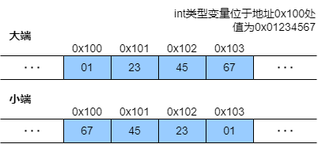
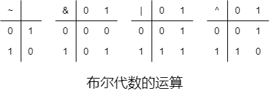
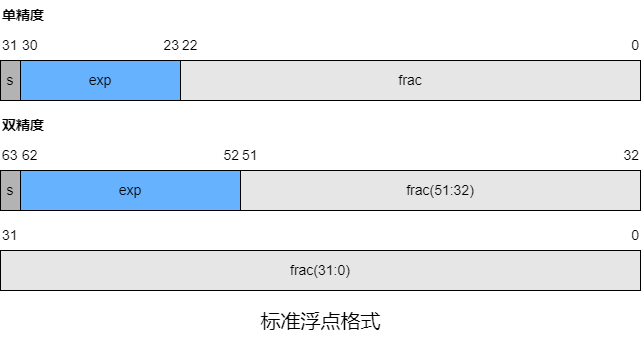
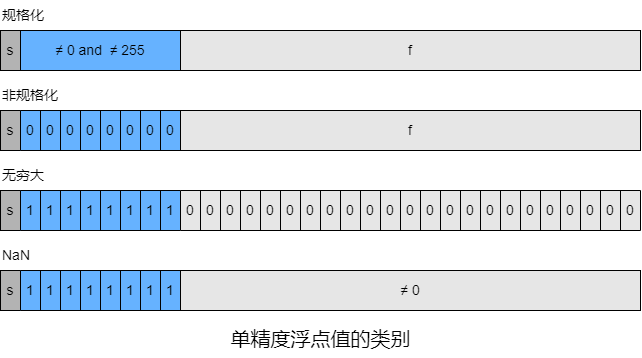
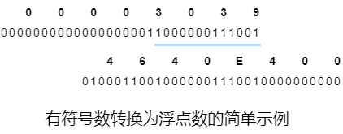

### 第二章 信息的表示和处理

​		使用了1000多年的十进制起源于印度，12世纪被阿拉伯数学家改进，并在13世纪被意大利数学家Leonardo Pisano(即Fibonacci)。对于10个手指头的人而言，十进制很自然，而现代计算机存储和处理的信息以二进制(称为**位**)表示。因为二进制更容易被表示、存储和传输，例如高电压和低电压等。

​		单个位并不是很有用，当把位组合在一起并附加上**解释**来赋予不同的可能位模式以意义时，可以表示任何任何有限集合的元素。

​		**无符号**编码基于传统的二进制表示法，表示大于等于0的数字。**补码**编码是表示有符号整数(有正负)的最常见的方式。**浮点**编码是以2为基数的科学计数法版本，用于表示实数。

​		计算机的表示使用有限数量的位来编码，因此当结果太大时以至于不能表示时，某些运算可能**溢出**。溢出可能会导致奇怪的结果，例如大多数计算机(`int`有32位)有$200\times300\times400\times500=-884901888$。

​		计算机的整数运算满足数学中整数运算的许多属性，例如乘法的结合律和交换律。计算机的浮点运算具有完全不同的数学属性。正数间的乘积始终为正，尽管溢出时会产生特殊值$+\infty$。由于表示的精度有限，浮点运算不是不可结合的，例如大多数计算机上，C语言有$(3.14+10^{20})-10^{20}=0.0$，而$(3.14+10^{20})-10^{20}=3.14$。整数与浮点算术的不同数学属性源于它们处理器表示的有限性的方式不同，整数是精确的，但表示的值范围较小；浮点是近似的，但表示的值范围较大。

​		ASCII字符集适合对英语文档进行编码，但不支持特殊字符(希腊语、俄语和中文等)。多年来，提出了很多方法来对不同语言进行编码。Unicode联盟设计了最全面和最广泛的文本编码标准，7.0版本的Unicode标准的拥有超过100000个字符，支持多种语言，包括古埃及语和巴比伦语。Unicode技术委员会否决了为克林贡语编写语言标准的提议。

​		基本编码称为Unicode的通用字符集，它使用32位表示字符，这似乎要求文本中的每个字符占用4个字节。若常见字符仅需1或2个字节，而不太常见的字节需要更多字节，可以使用代替编码，例如UTF-8，其表示形式将每个字符编码为字节序列，所有ASCII字节序列用ASCII码表示和UTF-8表示相同。Java语言使用Unicode表示字符串，C语言也有支持Unicode的库。

​		由于二进制是计算机编码、存储和操作信息的核心，故围绕0和1的研究已演化出了丰富的数学知识体系，这起源于1850年前后的乔治 • 布尔(George Boole,1815-1864)的工作，因此称为**布尔代数**。布尔观察到将逻辑值TRUE和FALSE编码为二进制值0和1可以指定一个捕捉逻辑推理的基本原则。

​		ISO C99在文件`<stdint.h>`引入了固定长度的整数类型，它们的声明类似`intN_t`和`uintN_t`，N值表示N位有符号和无符号整数。N的具体值与实现有关，但大多数编译器允许值为8、16、32和64。这些整数类型有一组对应的宏，即`INTN_MIN`、`INTN_MAX`和`UINTN_MAX`。

#### 2.1 信息存储

​		大多数计算机使用8位的块(称为**字节**)作为最小的可寻址的内存单元而非访问内存中单独的位。计算机级程序将内存视为很大的字节数组，称为**虚拟内存**。内存的每个字节都由一个唯一的数字标识，称为**地址**，所有可能的地址集称为**虚拟地址空间**。

​		一个字节由8位组成，二进制值域是$00000000_2\sim11111111_2$，十进制值域是$0_{10}\sim255_{10}$。两种表示法对于描述位模式都不是很方便，二进制太冗长，十进制需要转换，显然**十六进制**更具优势。

| 二进制 | 十进制 | 十六进制 |
| ------ | ------ | -------- |
| 0000   | 0      | 0        |
| 0001   | 1      | 1        |
| 0010   | 2      | 2        |
| 0011   | 3      | 3        |
| 0100   | 4      | 4        |
| 0101   | 5      | 5        |
| 0110   | 6      | 6        |
| 0111   | 7      | 7        |
| 1000   | 8      | 8        |
| 1001   | 9      | 9        |
| 1010   | 10     | A        |
| 1011   | 11     | B        |
| 1100   | 12     | C        |
| 1101   | 13     | D        |
| 1110   | 14     | E        |
| 1111   | 15     | F        |

​		C语言中，以`0x`和`0X`开头的数字即十六进制，字符`A`~`F`大小写不限。

##### 2.1.1 数据长度

​		每个计算机都有**字长**，表示指针数据的标称大小。因为虚拟地址是以这样的字来编码，因此由字长决定的最重要的系统参数是虚拟地址空间的最大大小。对于字长$w$位的计算机，虚拟地址的范围是$0\sim2^w-1$。32位字长虚拟地址空间为$4GB$，即刚超过$4\times10^9B$。64为字长虚拟地址空间为$16EB$，约为$1.84\times10^{19}B$。

​		程序分为32位程序和64位程序，区别在于编译过程而非运行的计算机类型。大多数64位计算机可以兼容32位计算机编译的程序。

​		计算机和编译器支持多种不同方法编码的数据格式，如不同长度的整数和浮点数。C语言中某些数据类型字节数取决于程序的编译方式。整数可以为**有符号**(有正负)或**无符号**(非负)。`char`名称源于其用于存储单个字符，但也可用于存储整数。为了避免字长和不同编译器设置导致数据类型长度不统一，ISO C99引入了一类数据类型，其数据大小是固定的，例如`int32_t`和`int64_t`。指针使用程序的全字长。大多数计算机还支持4的单精度和$8B$的双精度两种浮点数格式。

| 有符号(C语言)   | 无符号(C语言)    | 字节数(32位) | 字节数(64位) |
| --------------- | ---------------- | ------------ | ------------ |
| `[signed] char` | `unsigned char`  | 1            | 1            |
| `short`         | `unsigned short` | 2            | 2            |
| `int`           | `unsigned`       | 4            | 4            |
| `long`          | `unsigned long`  | 4            | 8            |
| `int32_t`       | `uint32_t`       | 4            | 4            |
| `int64_t`       | `uint64_t`       | 8            | 8            |
| `T *`           |                  | 4            | 8            |
| `float`         |                  | 4            | 4            |
| `double`        |                  | 8            | 8            |

​		大多数数据类型都编码为有符号数值，除非有前缀`unsigned`或使用固定大小数据类型的特定无符号声明，但`char`是例外。尽管大多数编译器和和计算机都将它们视为有符号数，但C语言标准不保证这一点。相反，如`[]`所示，应使用有符号字符的声明来保证其为$1B$的有符号数值。但大多数情况下，`char`是有符号或无符号不重要。

```c
unsigned long l1;
unsigned long int l2;
long unsigned l3;
long unsigned int l4;
```

​		C语言允许多种方式对关键字进行排序以及是否省略可选关键字，`l1`、`l2`、`l3`和`l4`意义相同。

​		程序的可移植性一方面就体现在对不同数据类型的确切大小不敏感。C语言标准对不同数据类型的数字范围设置了下限但不设上限。32位程序迁移到64位计算机时，很多隐藏的字长依赖项会作为错误出现，例如32位程序中`int`类型的对象可用于存储指针，但这会导致64位程序出现问题。

##### 2.1.2 寻址和字节顺序

​		对应跨越多个字节的程序对象，必须确定对象的地址以及字节在内存中的排列顺序。在几乎所有计算机中，多字节对象都存储为连续的字节序列，对象的地址是所使用字节中的最小地址，例如，假设`int`类型(32位)的变量`x`的地址为`0x100`，即地址表达式`&x`的值是`0x100`，则`x`的4个字节存储在内存位置`0x100`、`0x101`、`0x102`和`0x103`。



​		排列表示一个对象的字节有两个通用规则。以`w`位的整数为例，其位表示为$[x_{w-1},x_{w-2},\cdots,x_1,x_0]$，其中$x_{w-1}$是最高有效位，$x_0$是最低有效位。若$w$是8的倍数，则这些位可以分组为字节，其中最高有效字节包含位$[x_{w-1},x_{w-2},\cdots ,x_{w-8}]$，而最低有效字节包含位$[x_7,x_6,\cdots ,x_0]$，其他字节包含中间的位。某些计算机在内存中按从最低有效字节到最高有效字节的顺序存储，而其他计算机从最高有效字节到最低有效字节的顺序存储。前一规则(最低有效字节在最前面)称为**小端**，后一规则(最高有效字节在最前面)称为**大端**。大多数与Intel兼容的计算机都仅以小端模式运行，而IBM和Oracle的大多数计算机以大端模式运行。有部分微处理器是**双端**，即可以配置为大端或小端。但实际中，一旦选择了特定的操作系统，字节顺序就会固定，例如，许多手机使用的ARM微处理器是双端，但Android和IOS仅以小端模式运行。

​		对于大多数应用程序程序员，其计算机所使用的字节顺序是完全不可见的。无论为哪种类型的计算机所编译的程序都会得到相同的结果，但有时字节顺序会成为问题。

​		● 当二进制数据通过网络在不同计算机间通信时，若计算机的字节顺序不同，接收端和发送端的字节相反。为了避免此类问题，为网络应用程序编写的代码必须遵循既定的字节排序约定，以确保发送端将其内部表示转换为网络标准，而接收端则将网络标准转换为其内部表示。

​		● 阅读表示整数数据的字节序列时字节顺序很重要。

```assembly
4004d3:	01 05 43 0b 20 00	add	%eax,0x200b43(%rip)
```

​		以上代码是Intel x86-64处理器的计算机级代码的文本表示，由反汇编器生成，**反汇编器**是确定可执行程序文件表示的指令序列的工具。十六进制字节序列`01 05 43 0b 20 00`是一条指令的字节级表示形式，该指令将单字长的数据加到一个值上，该值的存储地址由`0x200b43`加上当前PC的值(要执行的下一指令的地址)得到。若取序列的最后4个字节`43 0b 20 00`并以小端方式写入，得到`00 20 0b 43`，去掉开头作为填充的0，得到值`0x200b43`，这就是右边的值。

​		● 在编写绕过普通类型系统的程序时字节排序很重要。C语言中，可以通过使用**强制类型转换**和**联合**来允许一种数据类型引用一个对象，但该数据类型与创建该对象时定义的数据类型不同。

```c
#include <stdio.h>

/* 使用强制类型转换来访问和打印不同程序对象的字节表示形式 */
typedef unsigned char *byte_pointer;

void show_bytes(byte_pointer start, size_t len)
{
    size_t i;
    for (i = 0; i < len; i++)
    {
        printf(" %.2x", start[i]); // 至少用2个数字的十六进制格式输出
    }
    printf("\n");
}

void show_int(int x)
{
    show_bytes((byte_pointer)&x, sizeof(int));
}

void show_float(float x)
{
    show_bytes((byte_pointer)&x, sizeof(float));
}

void show_pointer(void *x)
{
    show_bytes((byte_pointer)&x, sizeof(void *));
}
```

```c
void test_show_bytes(int val)
{
    int ival = val;
    float fval = (float)ival;
    int *pval = &ival;
    show_int(ival);
    show_float(fval);
    show_pointer(pval);
}
```

​		若参数为`12345`，对应的十六进制是`0x00003039`，Linux和Windows都是小端，Windows-64的输出是`39 30 00 00`、`00 e4 40 46`以及`4c fb 9f e4 9f 00 00 00`。`int`和`float`的字节模式看似不同，将其转换为二进制后会发现会有13个匹配的位序列。指针值根据不同的计算机或操作系统配置的存储分配规则分配。

​		C语言中的字符串以`null`(值为0)字符结尾的字符数组编码。每个字符都有一些标准编码来表示，最常见的是ASCII。若以参数`"12345"`和`6`来运行`show_bytes`可以得到结果`31 32 33 34 35 00`。十进制数字`n`的ASCII码是`0x0n`，终止字节的ASCII码为`0x00`。ASCII码在任何系统上都可以获得相同的结果，与字节顺序以及字长无关。因此，文本数据比二进制数据更具平台独立性。

##### 2.1.3 布尔代数简介



​		最简单的布尔代数是在双元集合$\{0,1\}$上定义。布尔运算~对应逻辑运算NOT，用$\lnot$表示。布尔运算&对应逻辑运算AND，用$\land$表示。布尔运算|对应逻辑运算OR，用$\lor$表示。布尔运算^对应逻辑运算EXCLUSIVE-OR，用$\oplus$表示。

​		布尔运算也适用于**位向量**(固定长度$w$，由0和1组成的串)。位向量的运算可以定义成参数的每个对应元素间的元素。若$a$和$b$分别表示位向量$[a_{w-1},a_{w-2},\cdots ,a_0]$和$[b_{w-1},b_{w-2},\cdots ,b_0]$，$a$&$b$可以定义为长度为$w$，其中第$i$个元素等于$a_i$&$b_i$，通过类似的方式可以将|、~和^扩展到位向量上。

​		对于长度为$2^w$的位向量，布尔代数和整数算术有很多相似之处。类似乘法对加法的分配律，&和|相互都有分配律，即$a$&$(b$|$c)=(a$&$b)|(a$&$c)$和$a$|$(b$&$c)=(a$|$b)$&$(a$|$c)$。

​		对长度为$w$的位向量进行^、&和~会得到一种称为**布尔环**的数学形式。布尔环与整数算术有很多相似之处，例如，整数算术的一个数学是每个值$n$都有一个**加法逆元**$-n$使得$n+-n=0$。

​		位向量的一个应用是表示有限集合。用位向量$[a_{w-1},a_{w-2},\cdots ,a_0]$对任何子集$A\subseteq\{0,1,\cdots ,w-1\}$编码，其中$i\in A$时$a_i=1$。若$a_{w-1}$在左边，$a_0$在右边，位向量$a=[01101001]$编码集合$A=\{0,3,5,6\}$，而$b=[01010101]$编码集合$B=\{0,2,4,6\}$。使用这种编码集合的方式，布尔运算|、&和~分别对应交集、并集和补集。$a$&$b$得到位向量$[0100001]$，而$A\cap B=\{0,6\}$。

##### 2.1.4 C语言相关支持

​		C语言提供布尔运算，其符号也是`~`、`&`、`|`和`^`，能运用到任何整型数上。

​		位级运算的一个应用是**掩码**运算，掩码是一种位模式，表示从字中选出的位集合，例如，掩码`0xFF`表示字中的低位字节。位级运算`n&0xFF`生成一个值，其低位字节由`n`的低位字节组成，其他值全为0。`~0`可以生成一个值全为1的掩码。

​		C语言还提供一组逻辑运算符`||`、`&&`和`!`，分别对应逻辑OR、AND和NOT运算。此外，C语言也提供**移位**运算，用于向左和向右移动位模式。对于位模式为$[x_{w-1},x_{w-2},\cdots ,x_0]$的操作数x，`x<<k`会生成一个值，其位模式是$[x_{w-k-1},x_{w-k-w},\cdots ,x_0,0,\cdots ,0]$，即`x`向左移动`k`位，丢弃最高k位并在右端补k个0。显然，偏移量应该介于0和w-1间。移位操作从左到右关联，故`x<<j<<k`等效于`(x<<j)<<k`。

​		计算机通常支持**逻辑右移**和**算术右移**。逻辑右移类似于右移，直接在左端补k个0。算术右移在左端补k个最高有效位的值，即$[x_{w-1},\cdots ,x_{w-1},x_{w-1},x_{w-2},\cdots x_k]$，主要用于有符号整数。

| 操作             | 值                         |
| ---------------- | -------------------------- |
| `x`              | [01100011]  [10010101]     |
| `x<<4 `          | [0011*0000*]  [0101*0000*] |
| `x>>4`(逻辑右移) | [*0000*0011]  [*0000*1001] |
| `x>>4`(算术右移) | [*0000*0011]  [*1111*1001] |

​		C语言标准并未定义有符号数应使用的右移类型。实际中，几乎所有编译器/计算机组合都对有符号数使用算术右移，对无符号数使用逻辑右移。对于$w$位的数据类型，移动$k(k\geqslant w)$位，实际位移量为$k\bmod w$。

#### 2.2 整数表示

​		数学术语**双射**指函数$f$有两种方式，它将数字$x$映射为数值$y$，即$y=f(x)$，但它也可以反向操作，因为对于每个$y$都有唯一的$x$满足$f(x)=y$，这通过**反函数**$f^{-1}$来表示，即$x=f^{-1}(y)$。

| 符号     | 类型   | 含义             |
| -------- | ------ | ---------------- |
| $B2T_w$  | 函数   | 二进制转补码     |
| $B2U_w$  | 函数   | 二进制转无符号数 |
| $U2B_w$  | 函数   | 无符号数转二进制 |
| $U2T_w$  | 函数   | 无符号数转补码   |
| $T2B_w$  | 函数   | 补码转二进制     |
| $T2U_w$  | 函数   | 补码转无符号数   |
| $TMin_w$ | 常数   | 最小补码值       |
| $TMax_w$ | 常数   | 最大补码值       |
| $UMax_w$ | 常数   | 最大无符号数     |
| $+^t_w$  | 操作符 | 补码加法         |
| $+^u_w$  | 操作符 | 无符号数加法     |
| $*^t_w$  | 操作符 | 补码乘法         |
| $*^u_w$  | 操作符 | 无符号数乘法     |
| $-^t_w$  | 操作符 | 补码取反         |
| $-^u_w$  | 操作符 | 无符号数取反     |

​		有符号数和无符号数间转换可能导致错误或漏洞，解决方法之一是尽量不使用无符号数。无符号数并非一无是处，在表示布尔类型时很有用，ISO C99在`<stdbool.h>`中引入的`bool`本质是`unsigned char`。

##### 2.2.1 整型数据类型

​		C语言支持多种整型数据类型，每种数据类型用`char`、`short`、`long`等关键字来指定大小，<span style="background-color: yellow">默认</span>有符号数。

| C语言整型数据类型 | 32位程序的取值范围    | 64位程序的取值范围    |
| :---------------- | :-------------------- | :-------------------- |
| `[signed] char`   | $-2^7\sim2^7-1$       | $-2^7\sim2^7-1$       |
| `unsigned char`   | $0\sim2^8-1$          | $0\sim2^8-1$          |
| `short`           | $-2^{15}\sim2^{15}-1$ | $-2^{15}\sim2^{15}-1$ |
| `unsigned short`  | $0\sim2^{16}-1$       | $0\sim2^{16}-1$       |
| `int`             | $-2^{31}\sim2^{31}-1$ | $-2^{31}\sim2^{31}-1$ |
| `unsigned`        | $0\sim2^{32}-1$       | $0\sim2^{32}-1$       |
| `long`            | $-2^{31}\sim2^{31}-1$ | $-2^{63}\sim2^{63}-1$ |
| `unsigned long`   | $0\sim2^{32}-1$       | $0\sim2^{64}-1$       |
| `int32_t`         | $-2^{31}\sim2^{31}-1$ | $-2^{31}\sim2^{31}-1$ |
| `uint32_t`        | $0\sim2^{32}-1$       | $0\sim2^{32}-1$       |
| `int64_t`         | $-2^{63}\sim2^{63}-1$ | $-2^{63}\sim2^{63}-1$ |
| `uint64_t`        | $0\sim2^{64}-1$       | $0\sim2^{64}-1$       |

​		对于有符号整型数，负数的取值范围比正数的大1。C语言标准定义了每种整型数据类型的取值范围，其中正数和负数的取值范围是对此的，`int`类型为$2B$，`long`类型为$4B$。

| C语言整型数据类型 | C语言标准定义的取值范围 |
| :---------------- | :---------------------- |
| `[signed] char`   | $-2^7+1\sim2^7-1$       |
| `unsigned char`   | $0\sim2^8-1$            |
| `short`           | $-2^{15}+1\sim2^{15}-1$ |
| `unsigned short`  | $0\sim2^{16}-1$         |
| `int`             | $-2^{15}+1\sim2^{15}-1$ |
| `unsigned`        | $0\sim2^{16}-1$         |
| `long`            | $-2^{31}+1\sim2^{31}-1$ |
| `unsigned long`   | $0\sim2^{32}-1$         |
| `int32_t`         | $-2^{31}+1\sim2^{31}-1$ |
| `uint32_t`        | $0\sim 2^{32}-1$        |
| `int64_t`         | $-2^{63}+1\sim2^{63}-1$ |
| `uint64_t`        | $0\sim2^{64}-1$         |

##### 2.2.2 编码

​		对于$w$位的整数$x$，可以将其位向量记为$\vec{x}$。

​		将$\vec{x}$视为二进制表示的数就可以得到$\vec{x}$的无符号表示。在此编码中，每个位$x_i$的值都为0或1，值为1表示$2^i$应为数字值的一部分。
$$
B2U_w(\vec{x})\doteq\sum_{i=0}^{w-1}x_i2^i
$$
​		对于无符号数，$\vec{x}$的最小值是位向量$[00\cdots 0]$，最大值是位向量$[11\cdots 1]$，其整数值$UMax_w=2^w-1$，故函数$B2U_w$能定义为一个映射$B2U_w:\{0,1\}^w\rightarrow\{0,\cdots ,UMax_w\}$。$B2U_w$是一个双射，它能将每个长度为$w$的位向量都映射到$0\sim2^w-1$间的一个唯一值，也能将$0\sim2^w-1$间的每个整数都可以映射到一个唯一的长度为$w$的位模式(即$U2B_w$)。

​		在补码中，最高有效位解释为**负权**，也称为**符号位**，其权重为$-2^{w-1}$。
$$
B2T_w(\vec{x})\doteq-x_{w-1}2^{w-1}+\sum^{w-2}_{i=0}x_i2^i
$$
​		对于补码，$\vec{x}$的最小值是位向量$[10\cdots 0]$，其整数值$TMin_w=-2^{w-1}$，最大值是位向量$[01\cdots 1]$，其整数值$TMax=2^{w-1}-1$，故函数$B2T_w$能定义为映射$B2T_w:\{0,1\}^w\rightarrow\{TMin_w,\cdots ,TMax_w\}$。$B2T_w$同样也是双射。

​		C语言标准并未要求有符号数以补码形式表示，但几乎所有计算机都如此，但考虑到可移植性等因素，有符号数都默认补码。C语言库文件`<limits.h>`定义了一组常量来限定编译器运行的计算机的不同整数数据类型的取值范围，例如，它定义了常量`INT_MAX`、`INT_MIN`和`UINT_MAX`来定义有(有符号和无符号)`int`的取值范围。

​		有符号数的也能表示为**反码**，除了其最高有效位的权重是$1-2^{w-1}$，其他与补码相同。
$$
B2O_w(\vec{x})\doteq-x_{w-1}(1-2^{w-1})+\sum_{i=0}^{w-2}x_i2^i
$$
​		有符号数的还能表示为**原码**，其最高有效位是符号位，用于确定其他位是负权或正权。
$$
B2S_w(\vec{x})\doteq(-1)^{x_{w-1}} \cdot(\sum_{i=0}^{w-2}x_i2^i)
$$
​		原码和反码都有一个奇怪的特性，即数字$0$有两种不同的编码，两者都将$[00\cdots 0]$解释为$+0$，前者将$[10\cdots 0]$解释为$-0$，后者将$[11\cdots 1]$解释为$-0$。

​		补码来源于情况：对于$x(x>0)$，$-x$的$w$位表示为$2^w-x$。反码来源于属性：用$[111\cdots 1]-x$计算$-x$的反码表示。

##### 2.2.3 有符号数和无符号数的转换

​		C语言允许在不同的数值数据类型间转换，例如，从有符号数转换到无符号数，这种转换通常基于位而非数字。

```c
short v = -12345;
unsigned short uv = (unsigned short)v;
printf("v = %d, uv = %u\n", v, uv); // v = -12345, uv = 53191
```

```c
int i = -1;
unsigned ui = (unsigned)i;
printf("i = %d, ui = %u\n", i, ui); // i = -1, ui = 4294967295
```

​		-12345的16位补码与53191的16位无符号表示相同，-1的32位补码也与4294967295的32位无符号表示相同。这是大多数C语言中相同字长有符号数和无符号数间转换的规则，即数值可能改变，但位模式不会变。给定一个整数$x$，当$x$在范围$0\leqslant x\leqslant UMax_w$内，函数$U2B_w(x)$给出了$x$的唯一$w$位无符号表示形式。同样，当$x$在范围$TMin_w\leqslant x\leqslant TMax_w$时，函数$T2B_w(x)$给出了$x$的唯一$w$位补码表示形式。
$$
\begin{aligned}
T2U_w(x)&\doteq B2U_w(T2B_w(x))\\
U2T_w(x)&\doteq B2T_w(U2B_w(x))
\end{aligned}
$$
​		`0xCFC7`的16位位模式既是-12345的补码表示，也是53191的无符号表示，同时12345+53191=65536，该属性推广到给定位模式表示的两个数值(补码和无符号数)间的关系，无符号表示中$UMax$和补码-1具有相同的位模式，即$1+UMax_w=2^w$。

​		对于位模式$\vec{x}$，若计算$B2U(\vec{x})-B2T\vec(x)$，从$0$到$w-2$位的加权和将相互抵消，得到$x_{w-1}2^w$。
$$
B2U_w(T2B_w(x))=T2U_w(x)=x+x_{w-1}2^w
$$
​		在$x$的补码表示中，位$x_{w-1}$决定了$x$的正负。
$$
T2U_w(x)=
\begin{cases}
x+2^w&&{TMin_x\leqslant x<0}\\
x&&{0\leqslant x\leqslant TMax_w}
\end{cases}
$$
​		设$\vec{u}=U2B_w(u)$，即$U2T_w(u)$的补码表示。
$$
U2T_w(u)=-u_{w-1}2^w+u
$$
​		在$u$的无符号表示中，位$u_{w-1}$决定了$u$是否大于$TMax_w=2^{w-1}-1$。
$$
U2T_w(u)=
\begin{cases}
u&&{0\leqslant u\leqslant TMax_w}\\
u-2^w&&{TMax_w<u\leqslant UMax_w}
\end{cases}
$$
​		对于整数$x$，当在范围$0\leqslant x\leqslant TMax_w$内时$T2U_w(x)=U2T_w(x)=x$，在此范围外转换需要增加或减去$2^w$。

​		C语言处理包含有符号数和无符号数组合的表达式时会将有符号数隐式转换为无符号数，例如比较式`-1<0U`，若两者都是32位，则`-1`将转换为`4294967295U`并返回`false`。

##### 2.2.4 扩展数的位表示

​		若要将无符号数转换为位模式长度更长的无符号数，可执行**零扩展**(在位模式的开头填充0)。若$w$位的位向量$\vec{u}=[u_{w-1},u_{w-2},\cdots ,u_0]$和$w'$位的位向量$\vec{u}'=[0,\cdots ,0,u_{w-1},u_{w-2},\cdots ,u_0]$，当$w'>w$，则$B2U_w(\vec{x})=B2T_{w'}(\vec{x}')$。

​		若要将有符号数转换为位模式长度更长的有符号数，可执行**符号扩展**(在位模式的开头填充最高有效位的值)。若$w$位的位向量$\vec{x}=[x_{w-1},x_{w-2},\cdots ,x_0]$和$w'$位的位向量$\vec{x}'=[x_{w-1},\cdots ,x_{w-1},x_{w-1},x_{w-2},\cdots ,x_0]$，当$w'>w$，则$B2U_w(\vec{u})=B2U_{w'}(\vec{u}')$。令$w'=w+k$，需证明
$$
B2T_{w+k}([x_{w-1},...,x_{w-1},x_{w-1},x_{w-2},...,x_0])=B2T_w([x_{w-1},x_{w-2},...,x_0])
$$
​		根据数学归纳法，若能证明符号扩展1位时数值不变，则当符号扩展到任意位时也会保持数值不变。
$$
\begin{aligned}
B2T_{w+1}([x_{w-1},x_{w-1},x_{w-2},...,x_0])&=-x_{w-1}2^w+\sum^{w-1}_{i=0}x_i2^i\\
&=-x_{w-1}2^w+x_{w-1}2^{w-1}+\sum^{w-2}_{i=0}x_i2^i\\
&=-x_{w-1}2^{w-1}+\sum^{w-2}_{i=0}x_i2^i\\
&=B2T_w([x_{w-1},x_{w-2},...,x_0])
\end{aligned}
$$
​		C语言中将位模式长度较短的有符号数转换为位模式长度较长的无符号数时，需要先进行符号扩展，再完成有符号到无符号的转换。

##### 2.2.5 截断数值

​		将$w$位的位向量截断为$k$位时，将丢弃高$w-k$位，这可能会改变其值，这也是溢出的一种形式。

​		若$w$位的位向量$\vec{x}=[x_{w-1},w_{w-2},\cdots ,x_0]$，截断为$k$位后$\vec{x}'=[x_{k-1},w_{k-2},\cdots ,x_0]$，$x=B2U_w(\vec{x})$。若$x'=B2U_w(\vec{x}')$，则$x'=x\bmod 2^k$。若$x’=B2T(\vec{x}')$，则$x'=U2T_k(x\bmod 2^k)$，$U2T_k$将最高有效位$x_{k-1}$的权重从$2^{k-1}$转换为$-2^{k-1}$。
$$
\begin{aligned}
B2U([x_{w-1},x_{w-2},...,x_0])\bmod 2^k&=[\sum_{i=0}^{w-1}x_i2^i]\bmod 2^k\\
&=[\sum_{i=0}^{k-1}x_i2^i]\bmod 2^k\\
&=\sum^{k-1}_{i=0}x_i2^i\\
&=B2U_k([x_{k-1},x_{k-2},...,x_0])
\end{aligned}
$$
​		对于无符号数，所有截断的位都具有形如$2^i(i\geqslant k)$的权重，故这些权重中每个都在模运算下减少到0。

#### 2.3 整数运算

##### 2.3.1 无符号运算

​		对于位模式为$w$位的无符号数$x$和$y$，两者的运算$+^u_w$就是把和$x+y$的位模式截断为$w$位后的结果再转换为无符号数。当$x+y\geqslant 2^w$时会发生溢出，溢出后的结果显然小于$x$和$y$。当执行C语言程序时，溢出不会导致错误。
$$
x+^u_wy=
\begin{cases}
x+y&&{0\leqslant x+y<2^w}\\
x+y-2^w&&{2^w\leqslant x+y<2^{w+1}}
\end{cases}
$$
​		模加法形成了一种称为**阿贝尔群**的数学结构，这是以丹麦数学家Niels Henrik Abel(1802~1829)的名字命名，它是可交换的和可结合的。它有一个单元0且每个元素都有一个加法逆元。对于位模式为$w$位的无符号数$x$，必有一个值$-^u_wx$满足$-^u_wx+^u_wx=0$。
$$
-^u_wx=
\begin{cases}
x&&{x=0}\\
2^w-x&&{0<x\leqslant 2^w-1}
\end{cases}
$$

​		$x$和$y$的运算$*^u_w$也是将乘积$x\cdot y$的位模式($2w$位)截断为$w$位后的结果再转换为无符号数。
$$
x*^u_wy=(x\cdot y)\bmod 2^w
$$

##### 2.3.2 有符号运算

​		对于位模式为$w$位的有符号数$x$和$y$，两者的运算$+^t_w$就是把和$x+y$的位模式截断为$w$位后的结果再转换为有符号数。

​		$+^t_w$与$+^u_w$有相同的位级表示，因此$+^t_w$等同于先将参数转换为无符号数进行$+^u_w$在转换为有符号数。
$$
\begin{aligned}
x+^t_wy&=U2T_w(T2U_w(x)+^u_wT2U(y))\\
&=U2T_w[(x_{w-1}2^w+x+y_{w-1}2^w)\bmod2^2]\\
&=U2T_w[(x+y)\bmod 2^w]
\end{aligned}
$$
​		令$z\doteq T2U_w(x)+T2U_w(y)$，$z'\doteq z\bmod2^w$，$z''\doteq U2T(z')=x+^t_wy$。

​		● 当$-2^w\leqslant z<-2^{w-1}$时，$z'=z+2^w$，因此$0\leqslant z'<-2^{w-1}$，$z''=z'$。此时两个负数相加得到正数，称为**负溢出**。

​		● 当$-2^{w-1}\leqslant z<0$时，$z'=z+2^w$，因此$2^{2-1}\leqslant z'<2^w$，$z''=z$。

​		● 当$0\leqslant z<2^{w-1}$时，$z'=z$，因此$0\leqslant z'<2^{2-1}$，$z''=z$。

​		● 当$2^{w-1}\leqslant z<2^w$时，$z'=z$，因此$2^{w-1}\leqslant z'<2^w$，$z''=z-2^w$。此时两个正式相加得到负数，称为**正溢出**。
$$
x+^t_wy=
\begin{cases}
x+y+2^w&&{-2^w\leqslant x+y<-2^{w-1}}\\
x+y&&{-2^{w-1}\leqslant x+y<2^{w-1}}\\
x+y-2^w&&{2^{w-1}\leqslant x+y<2^w}
\end{cases}
$$
​		$TMin_w+TMin_w=-2^w$，这会导致负溢出，因此$TMin_w+^t_wTMin_w=0$。对于$x>Tmin_w$的$x$，数值$-x$可以表示为$w$位的补码，它们的和$-x+x=0$。
$$
-^t_wx=
\begin{cases}
TMin_w&&{x=-2^{w-1}}\\
-x&&{-2^{w-1}<x\leqslant 2^{w-1}-1}
\end{cases}
$$
​		获取补码的非有两种方法，一种获取补码的非的方法是对位模式中的每一位取反并将结果加1，另一种方法是先找到位模式中最右边的1并假设位置为$k$，将$k$左边的位所有位取反。

​		对于$w$位的位向量$\vec{x}$和$\vec{y}$，$x=B2T_w(\vec{x})$，$y=B2T_w(\vec{y})$，$x'=B2U_w(\vec{x})$，$y'=B2U_w(\vec{y})$。
$$
\begin{aligned}
(x'\cdot y')\bmod 2^w&=[(x+x_{w-1}2^w)\cdot(y+y_{w-1}2^w)]\bmod 2^w\\
&=[x\cdot y+(x_{w-1}y+y_{w-1}x)2^w+x_{w-1}y_{w-1}2^{2w}]\bmod 2^w\\
&=(x\cdot y)\bmod 2^w
\end{aligned}
$$
​		因此无符号数和有符号数乘法运算的位级表示相同。

​		$x$和$y$的运算$*^t_w$也是将乘积$x\cdot y$的位模式($2w$位)截断为$w$位后的结果再转换为有符号数。
$$
x*^t_wy=U2T_w((x\cdot y)\bmod 2^w)
$$

#### 2.4 浮点数

​		浮点数表示对形如$V=x\times 2^y$的有理数进行编码。对于执行涉及非常大的数($|V|>>1$)、非常接近于0的数($0<|V|<<1$)以及更普遍的作为实数运算的近似值的计算，它很实用。

​		直到20世纪80年代，每个计算机制造商都设计了自己的浮点数表示规则以及相关运算的细节，它们都更注重实现的速度以及简便而非精确。随着IEEE标准754的出现，这些都在1985年作为发生变化，IEEE 754是精心设计的标准，用于表示浮点数以及其执行的操作。这些工作始于1976年开始由Intel赞助，与8087(为8086处理器提供浮点支持的芯片)的设计同时进行。Intel请William Kahan作为顾问，帮助其为未来的处理器设计浮点标准。他们允许Kahan与一个委员会联手，在IEEE的主持下制定行业标准。委员会最终采用的标准很接近Kahan为Intel设计的标准。

##### 2.4.1 二进制小数

​		小数的十进制表示为$d_md_{m-1}\cdots d_1d_0.d_{-1},d_{-2}\cdots d_{-n+1}d_{-n}$。其中每个十进制数$d_i$取值范围是$0\sim9$。数字的权是相对小数点符合定义，左边的数的权是10的正幂，得到整数值，而右边的数的权是10的负幂，得到小数值。
$$
d=\sum^m_{i=-n}10^i\times d_i
$$
​		类似十进制，小数的二进制也能表示为$b_mb_{m-1}\cdots b_1b_0.b_{-1}b_{-2}\cdots b_{-n+1}b_{-n}$。小数点左边的数的权是2的正幂，右边的数的权是2的负幂。显然，小数点左移$n$位相当于除以$2^n$，右移$n$位相当于乘$2^n$。
$$
b=\sum^m_{i=-n}2^i\times b_i
$$
​		对于有些小数，并不能确切地用二进制表示，只能近似地表示，但增加二进制表示的长度可以提高其精度。

##### 2.4.2 IEEE浮点表示

​		IEEE浮点标准用$V=(-1)^s\times M\times 2^E$表示数。

​		● $s$表示**符号**，$s=1$表示负数，$s=1$表示整数，其中数值0的符号位解释作为特殊情况处理。

​		● $M$表示**尾数**，它是一个二进制小数，其范围是$1\sim 2-\epsilon$或$0\sim 1-\epsilon$。

​		● $E$表示**阶码**，其作用是对浮点数加权，该权是$2^E$。



​		在C语言中，单精度浮点格式有32位，其中有1位符号、8位阶码和23位尾数。双精度浮点格式有64位，其中有1位符号、11位阶码和52位尾数。



​		对于C语言中的单精度浮点值，阶码的值决定了其类别。$k$表示阶码位的模式长度，$n$表示尾数的位模式长度。

​		最普遍的情况是**规格化**数，其阶码的位模式不全为0或1。这种情况下，阶码被解释为**偏置**形式表示的有符号整数，即阶码的值$E=e-Bias$，其中$e$是无符号数，其位模式是$e_{k-1}\cdots e_1e_0$，$Bias$是偏置值$2^{k-1}-1$。因此，单精度浮点数的指数的取值范围是$-126\sim +127$，双精度浮点数的指数范围是$-1022\sim +1023$。尾数被解释为小数$f$，其中$0\leqslant f<1$，其二进制表示为$0.f_{n-1}\cdots f_1f_0$。尾数定义为$M=1+f$，这种方式也称为**隐含前导1**表示，因为$M$的二进制表示为$1.f_{n-1}\cdots f_1f_0$，这种表示方法可以获得额外精度，因为可以调整阶码$E$来保证尾数$M$在$1\leqslant M<2$范围内，故无需显示地表示前导位。

​		当阶码位模式全为0时，表示**非规格化**数。这种情况下，阶码值$E=1-bias$，尾数值$M=f$。它有2个用途，一个用途是表示数值0，因为规格化数的尾数$M\geqslant1$，不能表示0。实际上，$+0.0$的位模式全为0，但位模式的符号位为1，其他位全为0时表示$-0.0$。对于IEEE浮点格式，$+0.0$和$-0.0$在某些方面不同，其他方面相同。另一个用途是表示很接近0的数，提供了一个称为**渐进下溢**的属性，其中可能的数值均匀分布在$0.0$附近。

​		当阶码位模式全为1时，表示特殊值。当尾数位模式全为0时，表示无穷大，符号位是0时表示$+\infty$，符号位为1时表示$-\infty$。当两个很大的数相乘或除以0时，无穷大表示<span style="background-color: yellow">溢出</span>。当尾数位模式不全为0时，表示**非数字**，某些运算结果不为实数或无穷大时，返回非数字。在某些应用程序中，它们可用于表示未初始化的数据。

|                    | 阶码             | 尾数           | 数值                               |
| ------------------ | ---------------- | -------------- | ---------------------------------- |
| 最小的正非规格化数 | $M=f=2^{-n}$     | $E=-2^{k-1}+2$ | $V=2^{-n-2^{k-1}+2}$               |
| 最大的正非规格化数 | $M=f=1-2^{-n}$   | $E=-2^{k-1}+2$ | $V=(1-2^{-n})\cdot 2^{-2^{k-1}+2}$ |
| 最小的正规格化数   | $M=1+f=1$        | $E=-2^{k-1}+2$ | $V=2^{-2^{k-1}+2}$                 |
| 最大的正规格化数   | $M=1+f=2-2^{-n}$ | $E=2^{k-1}-1$  | $V=(1-2^{-n-1})\cdot 2^{2^{k-1}}$  |

​		以基于IEEE浮点格式的6位浮点表示为例，其中有3位阶码和2位尾数。其中偏置值$Bias=2^{3-1}-1=3$。对于规格化数，阶码值的取值范围是$-2\sim3$，尾数值的取值范围是$1\sim \frac{7}{4}$，最大值是$ \pm14$，最小值是$\pm \frac{1}{4}$。对于非规格化数，阶码值是$-2$，尾数值的取值范围是$0\sim \frac{3}{4}$，最大值是$\pm \frac{3}{16}$，最小值是$\pm 0$。显然，非规格数聚集在0附近，它们并不是均匀分布，越靠近原点越密集。对比规格数的最小值和非规格数的最大值，可以发现两者间的<span style="background-color: yellow">平滑过渡</span>，这主要是因为非规格化数的阶码值$E$的定义为$1-bias$而非$-bias$，这样弥补了非规格化数的尾数没有隐含前导1。



​		把部分整数值转换为浮点形式对理解浮点表示很右移。以数值12345为例，分别用32位有符号数和单精度浮点表示，其二进制表示为$[11000000111001]$，对应的规格化表示为$1.1000000111001_2\cdot 2^{13}$。为了用IEEE单精度浮点表示，将二进制小数点左移13位，丢弃开头的1并在结尾增加10个0，$e=E+bias=13+127=140$并转换为二进制，最后再加上符号位。

##### 2.4.3 浮点运算

​		浮点运算只能近似于实数运算，因为表示的范围和精度有限。因此，对于值$x$，需要一种系统的方法来找到可以用期望的浮点格式表示的最近接的值$x'$，这是**舍入**的任务。

​		IEEE浮点格式定义了4种舍入模式。向最近值舍入也称为向偶数舍入，是默认方式，它向上或向下舍入来尽量保证结果的最低有效数字为偶数。当有2个可能的舍入值，选择最低有效位为偶数的舍入值。以保留整数为例，1.40舍入到1，1.50和2.50都舍入到2，因为2是偶数。其他3种方式在实际值上产生<span style="background-color: yellow">确界</span>，分别是向上舍入、向零舍入和向下舍入。

​		向偶数舍入也能运用在二进制小数上，0是偶数，1是奇数。通常位模式形如$XX\cdots X.YY\cdots Y100\cdots$的数(最右边的$Y$是待舍入的位置)才会有2个可能舍入值。以保留2位小数为例，$10.00011_2(2\frac{3}{32})$舍入到$10.00_2(2)$，$10.00110_2(2\frac{3}{16})$舍入到$10.01_2(2\frac{1}{4})$，$10.11100_2(2\frac{7}{8})$舍入到$11.00_2(3)$，$10.10100_2(2\frac{5}{8})$舍入到$10.10(2\frac{1}{2})$。

​		将一组数据舍入后进行平均值计算时会引入统计偏差，无论向上舍入、向零舍入还是向下舍入，都会增大统计偏差，而向偶数舍入可以减小甚至避免统计偏差，因为大约一半的数据向上舍入，大约一半数据向下舍入。

​		IEEE浮点格式定义了用于确定运算结果的规则，将浮点值$x$和$y$看成实数，对实数定义某个运算$\odot$计算产生结果$Round(x\odot y)$，这是对实数的精确结果舍入后的结果。

​		整数(包括无符号和补码)加法形成了阿贝尔群，实数加法也形成了阿贝尔群，但需要考虑舍入。将$x+^fy$定义为$Round(x+y)$，该运算根据$x$和$y$的所有取值定义，虽然$x$和$y$都是实数，但由于溢出可能得到无穷大。对于所有$x$和$y$的值，该运算是可交换的，$x+^fy=y+^fx$。另一方面，该运算是不可结合的，例如，对于单精度浮点，$(3.14+10^{10})-10^{10}=0.0$，舍入会导致$3.14$会丢失，而$3.14+(10^{10}-10^{10})=3.14$。大多数在浮点加法下有逆元，$x+^f-x=0$，无穷大和非数字是例外，因为$+\infty-\infty=NaN$，$NaN+^fx=NaN$。

​		浮点加法满足单调性，而整数加法不具有该属性，若$a\geqslant b$，则$x+a\geqslant x+b(x\neq NaN)$。

​		由于浮点加法不具有结合性，`x = a + b + c`可能被编译器替换为`t = b + c`和`x = a + t`。在大多数情况下，这种差异无关紧要。编译器无法得知效率和忠于原始程序的确切行为的取舍，因此编译器通常很保守，避免任何可能对功能产生影响的优化。

​		浮点乘法也有常规乘数的很多属性。将$x\cdot^fy$定义为$Round(x\cdot y)$，该运算在乘法下闭合(虽然可能产生无穷大或非数字)，它是可交换的并且有1.0作为乘法恒等式。由于溢出或舍入而导致精度丢失，该运算是不可结合和不可分配的。该运算满足单调性，对于不为非数字的$a$、$b$和$c$，其中$a\geqslant b$，若$c\geqslant 0$，则$a\cdot^fc \geqslant b \cdot^f c$，若$c\leqslant0$，则$a\cdot^f c\leqslant b\cdot^f c$。

##### 2.4.4 C语言相关支持

​		C语言提供了`float`和`double`支持浮点数，其舍入模式是向偶数舍入。C语言并不要求计算机使用IEEE浮点格式，因此没有标准方法来更改舍入方式和获取特殊值，但大多数系统提供了`include(.h)`和过程库来提供这些支持，具体实现因系统而异。

```c
#define _GNU_SOURCE 1
#include <math.h>
```

​		当程序中出现上面这些代码时，GNU编译器GCC会定义常数`INFINTY`和`NAN`。

​		`int`转换为`float`时，数字可能舍入。`int`或`float`转换为`double`时，`double`有更大的取值范围，所以没有精度损失。`double`转换为`float`时，可能会溢出为$\pm\infty$或者舍入。`float`或`double`转换为`int`时，将会向零舍入，也可能会溢出，C语言没有为这种情况指定固定结果。Intel兼容的处理器指定位模式$[10\cdots00]$为**整数不定值**，从浮点转换为整数时若未分配合理的整数近似值就会产生该值。`(int)+1e10`会得到$-21483648$，即从正值变成负值。
